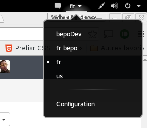

Xkbswitcher
===========

**Work In Progress**

Xkbswitcher is a simple Gnome-Shell extension to simplify the usage of customs layout located in the user directory (also at the system level, but it's not the purpose of this tool)

